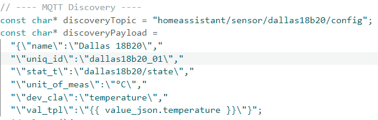
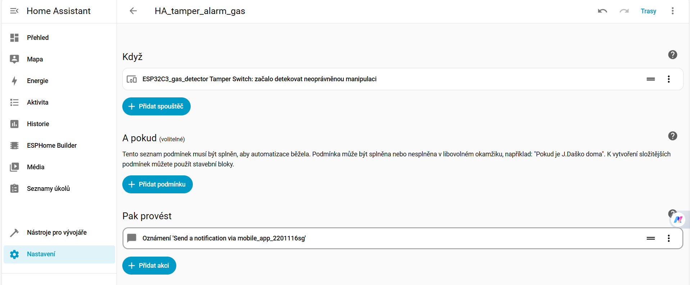
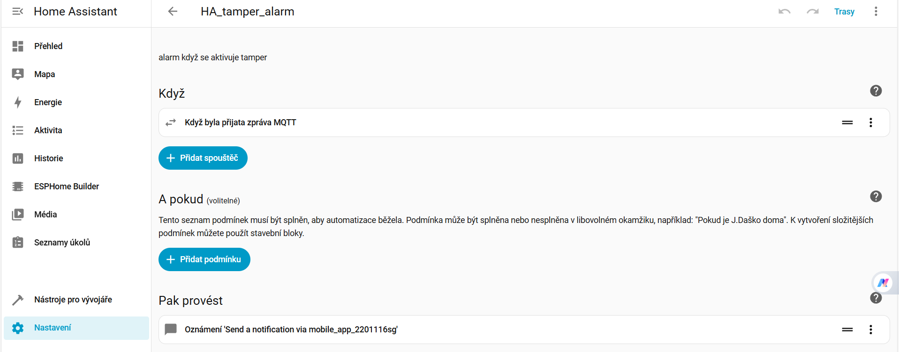
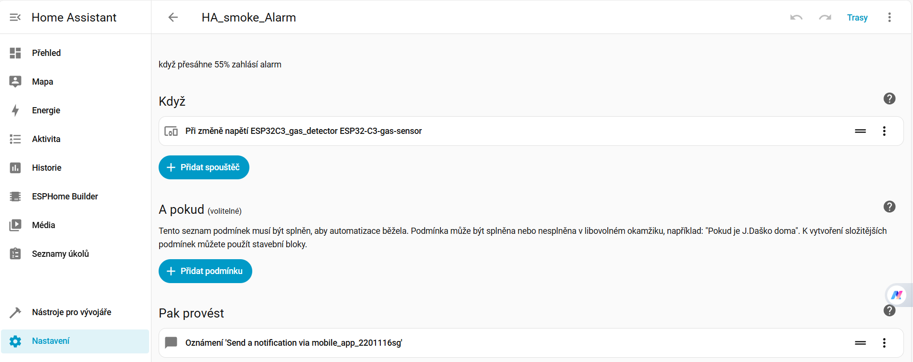

<h1> Home-Assistant </h1>

Tento kód slouží k měření teploty pomocí digitálního teplotního senzoru Dallas DS18B20. ESP32 čte teplotu a následně
  ji přes Wi-Fi odesílá pomocí MQTT protokolu do Home Asistantu.
  Soupis použitých komponent

<li>ESP32 super mini c3 [4]</a></li>
<li><a href="https://dratek.cz/arduino-platforma/1187-teplotni-senzor-digitalni-dallas-ds18b20.html">Dallas DS18B20
    Teplotní čidlo</a></li>
<li><a
    href="https://kitsguru.com/products/4-7k-resistance-1-4-watt-5-tolerance?variant=46112897171708&country=AE&currency=INR&utm_medium=product_sync&utm_source=google&utm_content=sag_organic&utm_campaign=sag_organic">Rezistor
    4,7kΩ</a></li>
<li>MQ-2 senzor hořlavých plynů (Čip: LM393,Sensor: ZYMQ) [2]</li>
<li>VirtualBoxu + Home Assistant [1] </li>

<section>
  <h2>Instalace Home Assistant na VirtualBoxu</h2>
  

    V rámci projektu jsem nasadil <strong>Home Assistant</strong>, který běží
    ve virtuálním stroji pomocí <strong>VirtualBoxu</strong> na Windows.
  

  

    Instalace a základní konfigurace byly provedeny podle oficiální dokumentace
    Home Assistantu. Postup jsem neupravoval a řídil se doporučeným návodem.
  

  

    Zdroj: instalační návod Home Assistant na Windows [1]
  

</section>

<section>

  <h2> Konfigurace MQTT v Home Assistantu </h2>

  

    Pro komunikaci mezi ESP32 a Home Assistantem jsem využil protokol MQTT. V Home Assistantu jsem nainstaloval doplněk
    "Mosquitto broker", který slouží jako MQTT broker pro přijímání a odesílání zpráv.
  

</section>
<section>
  <h3>Proč zrovna MQTT?</h3>
  

    jedná se o lightweight přenosový protokol, který posílá informace do tzv:"brokera".
    Zpráva obsahuje topic (např: Teplota/kuchyň) díky tomuhle se dá velice dobře organizovat záznamy a zařizení které
    tyto data potřebují si pošlou žádost o zpravu s daným topicem a broker pošle zprávu zpátky
      
  <ul><strong>Výhody:</strong>
    <li>nezatěžuje síť</li>
    <li>jednoduchý na nastasvení</li>
    <li>skvělě funguje s Homeassistantem (officiální add-on)</li>
    <li>skvělý na další rozšiřitelnost</li>
  </ul>

  

</section>\

<section>

  <h2>Funkce Home Assitentu a ESP32</h2>

  

    K ESP32 je připojen senzor
    koncentrace plynu (CO₂). Teplotní čidlo je v Home Assistantu přidáno jako
    samostatná entita. Hodnoty ze senzoru CO₂ jsou odesílány z ESP32 do
    Home Assistantu pomocí home-assistant API.
  

  <h3>IOT bezpečnost </h3>
  

    ohledně bezpečnosti jsme to vyřešily tak že do každého sensoru nainstalujeme tzv: "tamper switch" který se sepne po
    otevření krytu a nahlásí to do aplikace. Data jsou ochráněna tak že senzory sdílejí jednu osobu v homeassistantu
    která nemá admin prává, může mít přistup jen a pouze v lokální síti. Samotný broker může být kontaktován pouze z
    homeassistantu nebo jinou aplikací s účtem homeassistantu. tímto opatřením jsme zamezily zneužití a manipulace se
    systémem komukoliv bez oprávnění.
  

  

    Data ze senzorů nejsou odesílána nepřetržitě, ale pouze v pravidelných
    časových intervalech. Tento přístup snižuje spotřebu energie zařízení, což je důležité zejména u IoT systémů.
  

  

    Teplotní čidlo komunikuje pomocí MQTT pomocí kódu , který jsme my napsaly. Ten posílá konfigurační payload do
    brokeru s topicem
        
    a nasledně co naváže komunikaci tak posílá naměřená data
  

  

    Home Assistant umožňuje snadnou komunikaci s různými zařízeními a senzory
    pomocí MQTT protokolu. Po připojení ESP32 k Wi-Fi síti a odeslání dat
    do MQTT brokeru jsou senzory automaticky detekovány a je možné je
    monitorovat a vizualizovat v uživatelském rozhraní.

  

</section>
<section>
  <h3>Automatizace</h3>
  

    homeassistant má funkci automatizace, které jsme využily k alarmovým stavům
  <ul>
    <li>
      <h4>tamper automatizace</h4>
      <h5><strong>s esphome</strong></h5>
      

        s esphome jde udělat přepínáč, který sleduje napětové úrovně na pinu ESP32 C3, a pokud se změní nahlásí to a
        homeassistant pošle zprávu do aplikace
        
      

      <h5><strong>s naším kódem</strong></h5>
      

        náš kód má v sobě podmínku, když je na pinu logická nula tak pošle MQTT zprávu s topicem
        dallas18b20/alarm/tamper s obsahem "1" , tento topic poslouchá homeassistant a když se ukáže alarmová zpráva tak
        zahlásí alarm a pošle zprávu do aplikace.
        
      

    </li>
    <li>
      <h4>alarm automatizace</h4>
      
jedná se o alarm kvůli nadměrným hodnotám (nebezpečí požáru nebo vetší komulace plynů)

      <h4><strong>s esphome</strong></h4>
      

        u esphome se dá sledovat analogová hodnota na pinu a nastavit automatizaci tak že při změne hodnoty nad nějaké
        procento, tak zahlásí alarm a pošle zprávu do aplikace
        
      

      <h4><strong>náš kód</strong></h4>
      

        v našem kódu je podmínka pro tuto situaci a zase pošle MQTT zprávu s topicem dallas18b20/alarm/temp a s obsahem
        "1"(automatizace vypadá stejně jako u tamperu).
      

    </li>

  </ul>
  

</section>

<section>
  <h3>Dashboard</h3>
  

    Nastavení Dashboard je velice jednoduché a jde lehce nastavit pomocí návodu od oficiálních zdrojů [1].

  

</section>
<section>
  <h2>porovnání</h2>
  
budeme brát v potaz obtížnost jazyka, komunikace , vyčítaní hodnot a budoucí úpravy 

  <h3><strong>ESPHOME</strong></h3>
  

    <li>používá Yaml - težsí na pochopení kvůli neobvyklé syntaxy</li>
    <li>pro update používá OTA(over the air) - updaty kódu přes vzduch</li>
    <li>lehčí pro začátek díky automatickému navázání komunikace s homeassistantem</li>
    <li>add-on přímo v homeassistantovy</li>
  

  <h3><strong>Náš Kód</strong></h3>
  

    <li>víme co to přesně dělá a kam posílá</li>
    <li>lehčí programovací jazyk</li>
    <li>práce s knihovnama</li>
  

</section>
<section>
  <h2>co nám ještě chybí</h2>
  

    <li>dodělat krabičku</li>
    <li>napájet komponenty k sobě a dodat baterii</li>
    <li>dodělat sleep mód kvůli spotřebě baterie</li>
  

</section>

<section>
  <h3>Zdroje</h3>
  

    [1] HOME ASSISTANT. Home Assistant [online]. [viděno 2025-01-20]. Dostupné z: https://www.home-assistant.io
      
    [2] DRÁTEK. *Arduino.cz - MQ2 (MQ-2) senzor hořlavých plynů (propan, metan, butan, vodík)* [online]. [viděno
    2025-01-20]. Dostupné z: 
    https://dratek.cz/arduino-platforma/1074-mq2-mq-2-senzor-horlavych-plynu-propanu-metanu-butanu-vodiku.html 
      
   [3] KITSGURU. *4.7K Resistance 1/4 Watt 5% Tolerance* [online]. [viděno 2025-01-20]. Dostupné z:
    https://kitsguru.com/products/4-7k-resistance-1-4-watt-5-tolerance?variant=46112897171708&country=AE&currency=INR&utm_medium=product_sync&utm_source=google&utm_content=sag_organic&utm_campaign=sag_organic
     
   [4]ESP32-C3 super mini. Vokolo.cz, https://www.vokolo.cz/esp32-c3-super-mini/
. Přístup 1. ledna 2026.
  

  

</section>
